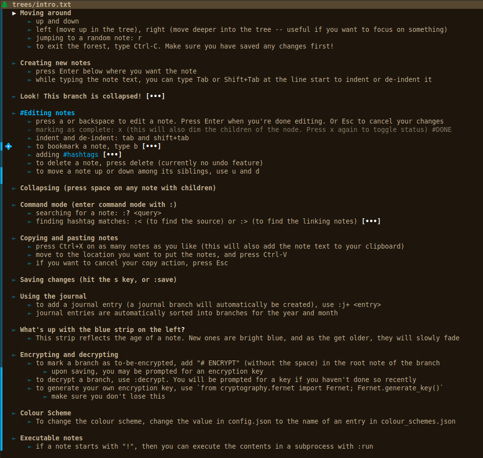

# forest
A minimal tree-based note interface made with love.

<p align="center">
  
  <br>
  
</p>

## Step 1: Install requirements

`python3 -m pip install -r requirements.txt`

## Step 2: Check out the intro

`python3 forest.py trees/intro.txt`

Or, watch the intro video here: TODO

## Step 3: Create your own tree!

```
touch trees/my_new_tree.txt
python3 forest.py trees/my_new_tree.txt
```
